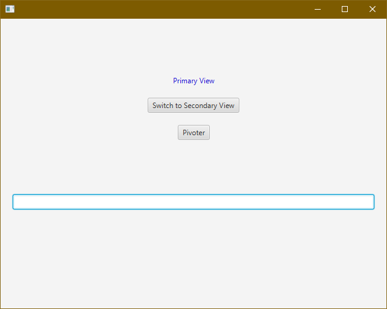
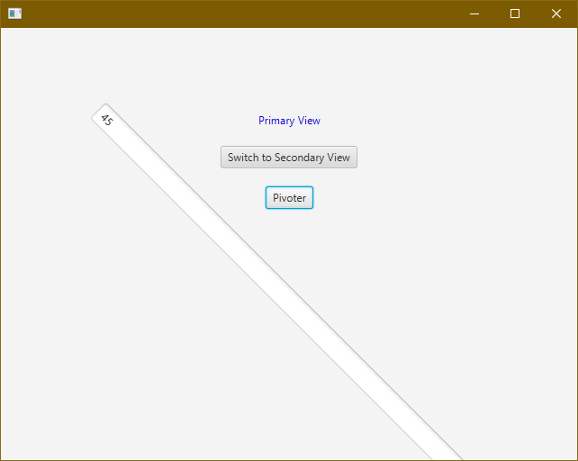

# PARTIE 1 - Conception d'une interface graphique avec JavaFX

## Création de projet JavaFX sous Maven (pour **VS Code** uniquement)

- Ouvrez VS Code ; aucun projet ne doit être chargé
  - si un projet est ouvert, fermez le répertoire : _File/Close Folder_
- Palette de Commande (_Ctrl+Shift+P_ ou _F1_), puis tapez "_Create Maven Project_"
- "_More..._"
- Recherchez "javafx" et sélectionnez "javafx-archetype-fxml" de _org.openjfx_
- Choisir la version la plus récente proposée
- Dans la fenêtre qui s'ouvre, sélectionnez le dossier contenant vos projets Java (un nouveau répertoire de projet y sera créé)
- `group-id` : _fr.dampierre_ (ou un autre nom de domaine fictif inversé, pas de majuscules, pas d'espaces)
- `artefact-id` : _projetjavafx_ (choisissez votre nom de projet, pas de majuscules, pas d'espaces)
- **dans le terminal qui s'ouvre**, validez la version et confirmez comme d'habitude
- BUILD SUCCESS ! (Non ? Vérifiez le JDK installé, et la variable d'environnement utilisateur `JAVA_HOME`...)
- VS Code vous propose, en bas à droite, d'ouvrir le projet nouvellement créé (sinon, ouvrez-le manuellement)

## Lancement de l'application

- Ouvrez le fichier `App.java` (dans `src`) et lancez l'application (_F5_) pour vous assurer de son bon fonctionnement
  - une fenêtre s'ouvre, contenant un label (_Primary View_) et un bouton unique (_Switch to Secondary View_)
  - appuyez sur le bouton
  - la fenêtre est remplacée par la _Secondary View_ et vous propose de repasser à la _Primary View_
- Cette petite application-démo ne fait rien d'autre que d'alterner entre deux vues, mais fixe les bases de fonctionnement d'une application JavaFX

## _Scene Builder_

- **_Scene Builder_** (SB) est une application indépendante de tout IDE qui permet de faciliter la réalisation d'interfaces graphiques (GUI) JavaFX
- Recherchez l'application _Scene Builder_ (https://gluonhq.com/products/scene-builder/) et installez-la
- Dans SB, on manipule des fichiers `.fxml`, pour créer et modifier des fichiers FXML contenant les vues (« écrans ») qui seront ensuite affichées par votre application JavaFX
- **Erreur fréquente** : SB ne vous rappelle pas de sauvegarder ; il arrive que l'on relance l'application sous VS Code après avoir modifié un écran FXML sous SB et que l'on se demande pourquoi ça ne fonctionne pas... Donc n'oubliez pas de sauvegarder vos fichiers sous SB.

## Installation d'extensions VS Code (optionnel)

Avant d'aller plus loin, vous pouvez installer ces deux extensions pratiques sous VS Code (panneau « Extensions » sur la gauche) :

- `JavaFX Support` : permet d'éviter quelques avertissements (_warnings_) issus de bugs ; sans cette extension ces avertissements viendront « polluer » vos éditeurs sous VS Code avec des problèmes en réalité inexistants
- `SceneBuilder extension for Visual Studio Code` : permet simplement d'ouvrir par clic-droit un fichier FXML directement dans Scene Builder ; pratique mais vraiment pas indispensable
  - il faut indiquer à cette extension où se trouve l'exécutable de SB sur le système - suivez les instructions de configuration du chemin sur la page de l'extension

## Ouverture d'une vue sous Scene Builder

- Sous VS Code, localisez et ouvrez le fichier `primary.fxml` dans le répertoire `resources`
- Ce fichier représente donc, sous forme de code FXML, l'interface graphique que vous voyez lorque l'application est lancée (la _Primary View_)
- Le format FXML a une structure hiérarchisée de type _markup_ (comme HTML, c'est un dérivé de XML)
- En général, on n'édite pas directement du code FXML (même si c'est tout à fait possible) : on utilise Scene Builder qui va permettre de modifier l'interface de manière beaucoup plus visuelle et intuitive
- Si l'extension est installée, faites un clic-droit sur `primary.fxml` et sélectionnez _Open in Scene Builder_
  - si pas d'extension, il faut ouvrir SB puis ouvrir le fichier `.fxml` depuis l'application
- L'interface graphique de la vue `primary.fxml` s'affiche au milieu de l'application

## Fonctionnement de Scene Builder

- Quatre grandes zones à différencier :
  - au centre : l'interface graphique sur laquelle on travaille
  - en haut à gauche (_Library_) : la bibliothèque de **_controls_**, qui sont les éléments graphiques (label, bouton, liste déroulante...)
  - en bas à gauche : la hiérarchie, qui retranscrit tous les _controls_ qui forment actuellement l'interface, sous forme d'arborescence
    - certains _controls_ sont des « conteneurs » qui peuvent contenir d'autres _controls_ (voir _Layout et hiérarchie_, plus bas)
    - par exemple, sur cette vue, on a un conteneur `VBox` qui est une « boîte verticale » qui permet d'empiler les _controls_ les uns en dessous des autres
    - la `VBox` contient deux *controls* :
      - un `Label` qui permet d'afficher le texte _Primary View_
      - un `Button` qui permettra de changer de vue
  - à droite (_Inspector_) : notamment les propriétés du _control_ actuellement sélectionné ; c'est là qu'on va modifier le texte d'un label, les dimensions d'un bouton, appliquer un effet, etc. (beaucoup de choses sont possibles pour chaque _control_)
- Le processus d'ajout de _control_ à l'interface consiste donc à :
  - localiser l'élément souhaité dans la _library_
  - le glisser-déposer directement dans l'interface graphique (ou dans la zone _hierarchy_, ce qui est parfois plus pratique pour indiquer qu'un élément doit se trouver à l'intérieur d'un conteneur précis)
  - modifier ses propriétés (texte, couleurs, marges...) dans le panneau _Inspector_

## Modification de l'interface

On va s'assurer que tout est bien en place en modifiant légèrement l'interface :

- Ajoutez un `Label` à la `VBox` (un `Label` est juste un texte non éditable, comme en HTML)
- Modifiez ses propriétés pour avoir le texte "Nouveau label" et une couleur de texte bleue
- *Enregistrez le fichier FXML* (`Ctrl-S`) : _Scene Builder_ ne le fera pas pour vous
- Revenez sous VS Code et relancez l'application
- Vous devez voir votre nouveau label s'afficher sur la _Primary View_, mais pas sur la _Secondary View_, qui n'a pas été modifiée
  - si ce n'est pas le cas, vérifiez que vous avez bien sauvegardé le FXML et que vous travaillez sur le bon fichier

## Architecture de JavaFX

- Tout tourne autour de l'interaction entre les fichiers `.java` (logique de l'application, code métier, édités sous VS Code) et les fichiers FXML (qui contiennent les interfaces graphiques, édités sous SB)
- Dans une application JavaFX :
  - on dispose d'un objet `Stage` (c'est la fenêtre principale) fourni par l'environnement d'exécution Java
  - le `Stage` contient un objet `Scene` (contenu de la fenêtre, qu'on va pouvoir changer au cours de l'application)
  - la `Scene` contient une `root` (racine) : c'est un fichier FXML qui décrit l'interface graphique
- L'idée est donc :
  - de créer sous SB autant de fichiers FXML qu'il y a de vues (d'écrans) dans l'application ;
  - de peupler la fenêtre (`Scene`) avec le fichier FXML d'accueil ;
  - de réagir dans le code Java aux événements qui sont détectés dans l'interface (clic sur un bouton, appui sur une touche...) : c'est ce qu'on appelle la *programmation événementielle*
  - tout en changeant de vue (la _root_) lorque nécessaire.

## Étude du code de l'application-démo

Étudions le code de la classe `App` :

```java
// App.java
public class App extends Application {

  private static Scene scene;

  @Override
  public void start(Stage stage) throws IOException {
    scene = new Scene(loadFXML("primary"), 640, 480);
    stage.setScene(scene);
    stage.show();
  }

  static void setRoot(String fxml) throws IOException {
    scene.setRoot(loadFXML(fxml));
  }

  private static Parent loadFXML(String fxml) throws IOException {
    FXMLLoader fxmlLoader = new FXMLLoader(App.class.getResource(fxml + ".fxml"));
    return fxmlLoader.load();
  }

  public static void main(String[] args) {
    launch();
  }
}
```

- (Ignorez le « bruit » que représentent les `...extends Application`, `...throws IOException`, `@Override`...)
- Cette classe dispose de 4 méthodes
  - la méthode `main` (point de départ du programme) se contente d'appeler la méthode `launch` du framework JavaFX
  - la méthode `launch` (invisible ici) va en fait appeler elle-même la méthode `start`, que l'on peut considérer comme le point de départ fonctionnel du programme
  - la méthode `start`
    - crée une `Scene` (`new Scene`) de 640x480 pixels en y chargeant la vue `primary.fxml`
    - indique au `Stage` que c'est la `Scene` qu'il faut utiliser (`setScene`)
    - et enfin l'affiche à l'écran (`show`)
  - la méthode `loadFXML` charge une vue FXML depuis un nom de fichier passé en paramètre (`String fxml`) et renvoie la vue sous forme utilisable (`Parent`)
  - la méthode `setRoot` permet de passer à la vue donnée en paramètre (`String fxml`)

## Hiérarchie

- Pour concevoir une interface graphique en JavaFX, il faut raisonner en terme de d'éléments conteneurs qui contiendront d'autres éléments
- Il y a donc une hiérarchie depuis la racine (_root_) qui est en général un conteneur
- Les conteneurs peuvent contenir récursivement d'autres containers, et ainsi de suite, sans limite de profondeur ; cela permet de concevoir des écrans potentiellement très complexes
- Par exemple, on pourra avoir :
  - un conteneur `VBox` (vertical)
  - qui contiendra lui-même :
    - un `Label` pour afficher un titre
    - une `ListView` pour afficher une liste de clients
    - un `TextField` (champ texte éditable) qui permettra de rechercher un client par son nom
    - un conteneur `HBox` (horizontal)
      - qui lui-même contiendra plusieurs boutons empilés horizontalement

## Les conteneurs

_La lecture de cette section et de ses sous-sections est facultative dans un premier temps._

Le panneau _Library_ contient plusieurs catégories de _controls_, dont les conteneurs. Chaque conteneur disponible est spécialisé pour une certaine disposition des éléments qu'il contient. Les sections suivantes en présentent quelques-uns.

### StackPane

- Empile les _controls_ les uns sur les autres, au centre
- En général on ne veut pas cela car les éléments sont cachés les uns derrière les autres

### AnchorPane

- Permet de « scotcher » (ancrer) les éléments par rapport au 4 bords du _container_
- Ainsi, quand on redimensionne, l'élément reste « ancré » par rapport aux bords désignés
- Souvent utilisé comme conteneur racine pour contrôler les marges

### GridPane

- Définit une grille _n x m_ dans laquelle on place les _controls_ sur _n_ lignes et _m_ colonnes
- Un _control_ pourra s'étendre sur plusieurs lignes et/ou colonnes, si besoin
- Conteneur très pratique, par exemple pour ranger trois lignes de couples `Label+TextField` (formulaire classique), on pourra utiliser une `GridPane` de 3x2

### FlowPane et TilePane

- Permet de définir des _controls_ les uns à côté des autres (ou les uns en dessous des autres)
- S'adapte à la taille de la fenêtre, dans le sens où les _controls_ « passeront à la ligne » si la place n'est pas suffisante

### BorderPane

- Permet de créer une disposition avec cinq sections : haut, bas, gauche, droite, centre (potentiellement vides)
- Chaque section est elle-même un conteneur pouvant contenir d'autres éléments
- C'est ainsi qu'est définie l'interface de SB, par exemple, avec ses panneaux sur les côtés

### SplitPane

- Permet de diviser l'espace en deux parties redimensionnables horizontalement ou verticalement
- Par exemple, le panneau gauche de VS Code est redimensionnable en faisant glisser le bord du panneau
- Typiquement, les deux zones d'un `SplitPane` contiennent un autre conteneur
- Un `SplitPane` peut contenir un autre `SplitPane`, etc. On peut ainsi construire un layout arbitrairement complexe dont chaque partie est redimensionnable

### HBox, VBox, ButtonBar

- `HBox` : placement horizontal
- `VBox` : placement vertical
- `ButtonBar` : spécialisé dans le placement horizontal de boutons

## Programmation événementielle

Une application avec une interface graphique moderne passe une bonne partie de son temps à attendre que certains événements se déclenchent. Le programme, au lieu d'avoir un flux d'exécution linéaire comme dans un programme classique (on exécute les lignes de code les unes après les autres), commence par afficher la vue d'accueil et _attend_. Il attend qu'un événement auquel il est _abonné_ se produise. Les événements en question sont de types divers :

- clic de souris
- appui sur touches du clavier
- passage de la souris au-dessus d'un élément spécifique
- chargement d'une vue
- etc.

Pour résumer, on peut « capter » tout ce qui se passe sur l'interface. Comme on « réagit » à des événements, on appelle ça de la **programmation événementielle**.

## Les controllers

À chaque vue FXML va correspondre un fichier Java qui va contenir le code de réaction aux événements auxquels on s'abonne : c'est le **controller**. Par exemple, dans l'application-démo, la vue d'accueil `primary.fxml` a un fichier controller associé : `PrimaryController.java`.

```java
// PrimaryController.java
public class PrimaryController {

  @FXML
  private void switchToSecondary() throws IOException {
    App.setRoot("secondary");
  }
}
```

Ce fichier ne comporte qu'une méthode : `switchToSecondary()`. Cette méthode est déclenchée lorsque l'utilisateur, depuis la vue _primary_, appuie sur le bouton. Le code de cette méthode appelle la méthode `setRoot` pour changer de vue. Un controller peut ainsi disposer de plusieurs méthodes qui réagissent à divers événements dans une vue spécifique.

Mais comment le programme sait-il que c'est _cette méthode_ dans _ce fichier_ qu'il faut précisément invoquer lors de l'appui sur le bouton ? Ces informations sont indiquées dans le fichier FXML et sont modifiables directement depuis Scene Builder.

## Branchement au controller depuis Scene Builder

Il y a plusieurs étapes à réaliser pour lier un _control_ JavaFX au code Java qui réagit à un événement sur ce *control* :

1. (SB) Nommer le ou les _control(s)_ concerné(s)
2. (SB) Localiser l'événement voulu et indiquer le nom de la future méthode associée dans le controller
3. (VSCode) Créer/modifier le controller pour la vue
4. (SB) Indiquer le nom du controller associé à la vue
5. (VSCode) Écrire le code de la méthode

Nous allons illustrer cette procédure au travers d'un exemple. Imaginons que nous souhaitions avoir un champ texte (`TextField`) et un bouton (`Button`) supplémentaires. Quand l'utilisateur entre un nombre entre 0 et 360 dans ce champ texte et appui sur le bouton, le champ texte doit opérer une rotation d'autant de degrés. Voyons comment obtenir cet effet en reprenant les étapes ci-dessus.

### Mise en place des nouveaux _controls_

- Sous SB, ajoutez un `Button` avec le texte `Pivoter` à la vue `primary`
- Ajoutez un `TextField` (champ texte)
  - **Attention**, il y a deux types de `TextField` disponibles dans la bibliothèque de *controls* : **_ne prenez pas le bleu_**
- Donnez une marge haute et une marge basse de 70 au `TextField`, afin de lui laisser de l'espace lorsqu'il va pivoter



### 1. Nommer les _controls_ concernés

Pour interagir avec les _controls_, il est souvent nécessaire que le code Java puisse les identifier. Par exemple, il faudra avoir une référence sur le `TextField` pour lui dire de pivoter. Pour cela, on lui donne un nom :

- Sous SB, sélectionnez le nouveau `TextField`
- Dans le panneau _Inspector_, ouvrir le sous-panneau _Code_ (tout en bas)
- Le champ `fx:id` représente l'identifiant du _control_ pour JavaFX
- Indiquez l'identifiant `txtPivot` pour le `fx:id`

### 2. Localiser l'événement voulu et indiquer la méthode associée

On va maintenant associer l'événement « clic sur le bouton *Pivoter* » à la méthode `btnPivoterClick` :

- Sous SB, sélectionnez le bouton
- Dans le panneau _Inspector_, ouvrir le sous-panneau _Code_
- Le champ _On Action_ représente le nom de la méthode à exécuter lors d'un clic
- Indiquez le nom `btnPivoterClick` (cette méthode n'existe pas encore, nous allons l'écrire par la suite dans le controller)

### 3. Créer/modifier le controller pour la vue

Étant donné qu'on travaille sur une vue avec un controller existant (`PrimaryController.java`), on n'a pas besoin d'en créer un nouveau ici. En revanche on doit lui ajouter les éléments nouveaux qui nous concernent ici, à savoir le nom du nouveau `TextField` et la méthode de réaction au clic sur le bouton. Pour cela, le plus simple consiste à se baser sur le « squelette » créé par SB :

- Sous SB, ouvrez le menu _View/Show Sample Controller Skeleton_
- Une fenêtre s'ouvre avec un squelette de classe controller contenant les _controls_ identifiés et les méthodes-événements définies
- Ici, vous retrouvez notamment notre élément `txtPivot` et la méthode `btnPivotClick`
- Copiez le code proposé correspondant à ces deux concepts
- Sous VSCode, collez-le dans le controller `PrimaryController` en conservant le code de la méthode `switchToSecondary`

```java
public class PrimaryController {

  @FXML
  private TextField txtPivot;

  @FXML
  void btnPivoterClick(ActionEvent event) {
  }

  @FXML
  private void switchToSecondary() throws IOException {
    App.setRoot("secondary");
  }
}
```

Dans le cas où l'on a créé une nouvelle vue, il faudra créer un nouveau fichier controller correspondant et y coller la totalité du code du squelette.

### 4. Indiquer le nom du controller associé à la vue

Le controller est en place, mais le FXML ne sait pas automatiquement que c'est vers lui qu'il faudra envoyer les événements.

- Sous SB, dans le sous-panneau _Document/Controller_ (sous _hierarchy_), indiquez grâce au menu déroulant que le controller concerné est `PrimaryController`
- Ici, cette action est inutile car `primary` était déjà relié au bon controller ; mais il ne faudra pas oublier cette étape lors de la conception de nouvelles vues

### 5. Écrire le code de la méthode

Tout est maintenant « branché », il reste à écrire le code qui doit effectivement s'exécuter lorsque le bouton est cliqué. Copiez le code suivant dans la méthode `btnPivoterClick` du `PrimaryController` :

```java
@FXML
  void btnPivoterClick(ActionEvent event) {
    String rotationString = txtPivot.getText();      // récupère le contenu du TextField
    int rotation = Integer.parseInt(rotationString); // transforme le texte récupéré en valeur int
    txtPivot.setRotate(rotation);                    // fait pivoter le TextField
  }
```

- Il est possible que quelques importations soient nécessaires pour que le code compile (utilisez l'ampoule jaune pour importer ce qu'il faut)
- Notez comment la méthode a accès au `TextField` en utilisant son identifiant `txtPivot` et la notation pointée pour appeler des méthodes dessus
- Testez l'application
  - au lancement, vous devriez voir votre vue modifiée (Non ? Avez-vous sauvegardé le FXML sous SB ?)
  - entrez la valeur 45 dans le champ texte
  - cliquez sur le bouton _Pivoter_
  - le champ texte devrait pivoter de 45 degrés



## Conseils

- Retenez comment l'appel `txtPivot.getText()` a permis de récupérer le contenu du champ texte
  - l'appel `setText("toto")` permettrait par exemple de modifier le contenu du champ texte en `"toto"`
- De manière générale, regardez ce qui est disponible lorsque vous tapez `unControl.` dans l'IDE à partir d'un _control_ graphique disponible dans le code ; essayez d'explorer les possibilités et de trouver par vous-même ce que vous cherchez à faire avec ce _control_
- Notez que le code précédent ne gère pas vraiment les erreurs : si l'utilisateur entre une valeur non-entière, une exception (erreur) est lancée, mais les applications avec interface graphique se contentent « d'avaler » l'erreur si elle n'est pas gérée et continuent à fonctionner si possible (mais ce n'est évidemment pas une bonne pratique de développement de laisser traîner des sources d'erreurs)
- Parfois, l'entête d'une méthode a besoin de la mention `...throws IOException` à la fin, pour indiquer que le code de la méthode pourrait lancer une exception (c'est le cas par exemple de la méthode `switchToSecondary`)
- Notez la façon dont les éléments graphiques ont été nommés dans cet exemple : un préfixe indique de quel type d'élément il s'agit
  - `txt` pour un champ texte, `btn` pour un bouton, etc.
  - ce n'est pas obligatoire mais c'est une bonne convention
- Notez que **chaque variable et chaque méthode déclarée en FXML (depuis SB) doit avoir l'annotation `@FXML`** côté controller sinon Java ne considérera pas que les deux sont reliés (mettre plusieurs déclarations de variables sous une seule annotation `FXML` n'est pas suffisant)
- N'attendez pas d'avoir fini complètement la vue avant de commencer à implémenter des fonctionnalités
  - dès que vous avez une vue suffisamment détaillée pour la mise en place d'au moins une fonctionnalité, il est temps de passer à la logique côté Java sous VS Code, pour coder le _controller_ qui va correspondre à cette vue
  - bien sûr, quand on travaille en groupe, un dev peut travailler sur l'UI pendant qu'un autre travaille sur le code
- Donnez des noms expressifs :
  - à vos vues FXML (ex : `Connexion.fxml`)
  - aux controlleurs associés (`ConnexionController.java`)
  - aux `fx:id` des éléments graphiques (`btnValider`)
  - aux méthodes-événement (`btnValiderClick`)
- Utilisez des instructions `println` au fur et à mesure pour afficher l'état de vos variables et vérifier que tout se passe bien, comme vous le faites dans vos programmes console habituels
  - les informations seront bien sûr affichées sur la sortie standard (le terminal) et non l'interface graphique, mais cela vous permettra de débuguer facilement

## À faire vous-même

Dans `secondary.fxml`, faire en sorte que, lorsque l'on clique sur un nouveau bouton *TEST* :

- la couleur du texte du bouton passe en rouge
- le texte du label indiquant `Secondary View` du dessus se change en `COUCOU !`
- la vue ne change plus vers la _Primary View_
