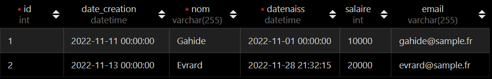
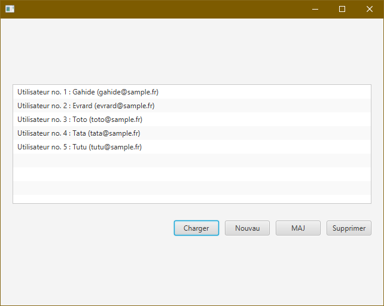

# PARTIE 2 - Accès à une base de données via JDBC

## JDBC

JDBC (_Java Database Connectivity_) est une interface de programmation Java qui permet aux applications d'accéder à une base de données relationnelle. Des pilotes JDBC sont disponibles pour tous les systèmes connus de bases de données relationnelles, comme MySQL.

## Installation

- Pour pouvoir utiliser facilement JDBC, votre projet de départ doit être généré par Maven
  - c'est le cas si vous avez créer votre projet comme demandé
- Dans votre projet généré par Maven :
  - ouvrez la palette de commande (_Ctrl+Shift+P_)
  - tapez `maven`
  - sélectionnez _Add a dependency_
  - tapez `mysql`
  - trouvez `mysql-connector-java` de _mysql_ et validez
  - la dépendance devrait être ajoutée automatiquement au fichier `pom.xml` (voir code ajouté ci-dessous)
  - approuvez la demande de VSCode (en bas à droite) de mise à jour de la configuration
  - voici l'ajout qui a été automatiquement fait au fichier `pom.xml`, qui contient la configuration de votre projet Maven :

```
<dependencies>
    ...
    <dependency>
        <groupId>mysql</groupId>
        <artifactId>mysql-connector-java</artifactId>
        <version>X.Y.Z</version>
    </dependency>
    ...
</dependencies>
```

- Si votre projet dispose d'un fichier `module-info.java` (s'il s'agit d'un projet JavaFX notamment), modifiez-le pour ajouter la dépendance au module `java.sql` (en ne touchant surtout pas au reste du fichier)
  - pour cela, ajoutez la ligne `requires java.sql` au fichier, à cet endroit :

```java
module fr... {
  // requires...
  requires java.sql;
  // opens...
  // exports...
}
```

Votre projet est maintenant configuré pour reconnaître du code JDBC d'accès à une BDD.

## Connexion à la BDD

Voici un exemple de code qui se connecte à une base de données :

- nommée `sample`
- sur un SGBDR MySQL
- lancé localement
- écoutant le port 3306
- avec l'identifiant `monid`
- et le mot de passe `monmotdepasse`

```java
String dbURL = "jdbc:mysql://localhost:3306/sample";
String nomUtilisateur = "monid";
String mdp = "monmotdepasse";

try {
  // Connexion en passant les informations spécifiées précédemment
  Connection conn = DriverManager.getConnection(dbURL, nomUtilisateur, mdp);
  // Si on est bien connecté à la DB
  if (conn != null) {
    // On affiche un petit message sur le terminal
    System.out.println("Connexion réussie !");
  }
} catch (SQLException ex) {
  // Code de traitement d'erreur
  ex.printStackTrace();
}
```

- C'est votre premier objectif => une connexion réussie à la BDD via Java (le message doit s'afficher dans la console)
- Notez que la connexion à la BDD (et tout code accédant à la BDD en général) est encapsulée dans un block `try...catch` : c'est une construction Java qui permet de capturer les erreurs éventuelles qui peuvent se produire lors de la connexion et permettent de récupérer le contrôle du flux d'exécution (au lieu d'avoir un programme qui se termine de manière abrupte par un message d'erreur, on va dans le `catch` pour traiter l'erreur)
- Une fois la connexion établie, on a un objet `Connection` appelé ici `conn` que l'on pourra utiliser pour exécuter des requêtes SQL.
- Le code ci-dessus est un exemple que vous adapterez en fonction de vos besoins ; vous placerez ce code, dans votre programme, à un endroit adéquat pour le tester dans un premier temps (la méthode `main` par exemple)

## Requête d'interrogation

**Attention** : dans la suite, lorsque vous résolvez les imports d'objets SQL manquants (avec la petite ampoule ou bien `Ctrl+;`), regardez bien ce qui vous est proposé et sélectionnez les packages issus de `java.sql` (parfois d'autres packages sont proposés par défaut).

Voici du code permettant de faire une requête d'interrogation à partir d'un objet `Connection` `conn` construit précédemment à partir de la table exemple suivante :



```java
// Définition de la requête qui va être faite
String sql = "SELECT nom, email FROM utilisateurs";
// Création d'un objet Statement qui représente une requête
Statement requete = conn.createStatement();
// Exécution de la requête
// et récupération des résultats dans un ResultSet
ResultSet res = requete.executeQuery(sql);

int compteur = 0;
// On parcourt le ResultSet en appelant la méthode next() au fur et à mesure
// À chaque fois, la variable res "pointe" sur le résultat suivant dans la liste
// renvoyée par le SELECT
while (res.next()) {
  compteur++;
  String nom = res.getString("nom");     // récupération du champ "nom" pour ce résultat
  String email = res.getString("email"); // récupération de l'email
  // Construction et affichage de la sortie
  String sortie = "Utilisateur no. " + compteur + " : " + nom + " (" + email + ")";
  System.out.println(sortie);
}
// Lorsqu'il n'y a plus de lignes dans le ResultSet, next() renvoie false
// et on sort de la boucle while
```

Et voici un exemple de sortie (sur le terminal) :

```
Utilisateur no. 1 : Gahide (gahide@sample.fr)
Utilisateur no. 2 : Evrard (evrard@sample.fr)
```

- Ici, on a appelé sur le `ResultSet` la méthode `getString()` pour récupérer le nom et l'email, mais il existe d'autres méthodes pour récupérer d'autres types :
  - `getInt()`
  - `getFloat()`
  - `getDate()`
  - `getTimestamp()`
  - ...
- On aurait pu aussi récupérer ces informations en utilisant les index (position dans le SELECT) :
  - `res.getString(1)` pour le nom
  - et `res.getString(2)` pour l'email
  - cela est légèrement plus performant, mais moins lisible

## Requête d'insertion

Ce code insère un nouvel utilisateur avec des données « en dur » (sauf la date de création). En général, vous voudrez plutôt que les données à insérer proviennent de variables qui auront été définies notamment en récupérant des valeurs entrées par l'utilisateur dans une interface graphique.

```java
// Construction de la requête d'insertion
String sql = "INSERT INTO utilisateurs (nom, date_creation, datenaiss, salaire, email) VALUES ('Toto', '"
                + LocalDate.now() + "', '2021-01-01', 5000, 'toto@sample.fr')";
Statement requete = conn.createStatement();
// Exécution de la requête
// Et récupération du nombre d'insertions effectives (ici 1)
int nbInsertions = requete.executeUpdate(sql);
// La variable nbInsertions nous permet de savoir si l'insertion s'est bien passée
if (nbInsertions > 0) {
  System.out.println("Un nouvel utilisateur a bien été ajouté");
}
```

## Requête de mise à jour

Ce code change l'email d'un utilisateur spécifique. De nouveau, l'id de l'utilisateur et le nouvel email proviendront plus sûrement de variables.

```java
String sql = "UPDATE utilisateurs SET email='gahide@sample.com' WHERE id=1";
Statement requete = conn.createStatement();
int nbUpdates = requete.executeUpdate(sql);
if (nbUpdates > 0) {
  System.out.println("L'utilisateur d'id 1 a bien été mis à jour");
}
```

## Requête de suppression

Ce code supprime le premier utilisateur trouvé. Encore une fois, cette requête d'illustration est complètement naïve et ne devra jamais apparaître telle quelle dans du code de production.

```java
String sql = "DELETE FROM utilisateurs LIMIT 1";
Statement requete = conn.createStatement();
int nbSuppressions = requete.executeUpdate(sql);
if (nbSuppressions > 0) {
  System.out.println("Un utilisateur a bien été supprimé");
}
```

## Affichage d'une liste en JavaFX

- Une fois que le CRUD fonctionne sur le terminal, on va vouloir afficher des listes depuis l'interface graphique
- On va pour cela utiliser le _control_ `ListView`
- L'extrait suivant reprend le code de la requête d'interrogation précédente en y ajoutant du code pour peupler une `ListView` JavaFX
- Prérequis : il faut, dans la vue correspondante au controller sur lequel va s'exécuter ce code, qu'il y ait un _control_ `ListView` ayant un `fx:id` nommé `lvUtilisateurs`

```java
String dbURL = "jdbc:mysql://localhost:3306/sample";
String nomUtilisateur = "monid";
String mdp = "monmotdepassefort";

// Liste dont va se servir la ListView (initialement vide)
ObservableList<String> utilisateurs = FXCollections.observableArrayList();

try {
  Connection conn = DriverManager.getConnection(dbURL, nomUtilisateur, mdp)
  if (conn != null) {
    System.out.println("Connected");
    String sql = "SELECT nom, email FROM utilisateurs";
    Statement requete = conn.createStatement();
    ResultSet res = requete.executeQuery(sql);

    int compteur = 0;
    while (res.next()) {
      compteur++;
      String nom = res.getString("nom");
      String email = res.getString("email");
      String sortie = "Utilisateur no. " + compteur + " : " + nom + " (" + email + ")";
      // On ajoute cette string à la liste
      utilisateurs.add(sortie);
      System.out.println(sortie);
    }
  }
} catch (SQLException ex) {
  ex.printStackTrace();
}
// Finalement, on peuple la ListView avec la liste d'utilisateurs construite
lvUtilisateurs.setItems(utilisateurs);
```

Ce code peuple la `ListView` dont le `fx:id` est `lvUtilisateurs`. Il est utilisé lors de l'appui sur le bouton _Charger_ de cette vue :


