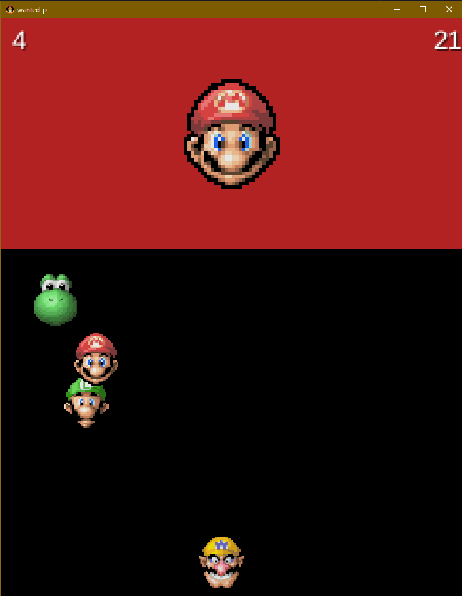

:last-update-label!:

= Programmation Orientée Objet - Projet libGDX

== Projet de base

* https://classroom.github.com/a/NA9UAqwE[Lien d'invitation] pour le projet de base libGDX
* Comme d'habitude, clonez le dépôt créé pour y travailler localement
* Vous ferez vos _commits_ sur ce dépôt local et pousserez régulièrement sur GitHub
* Ce projet a été généré à partir de https://libgdx.com/wiki/start/project-generation[gdx-liftoff]

== libGDX

libGDX est un framework open-source puissant et polyvalent pour le développement de jeux. Conçu en Java, il permet de créer des applications pour une multitude de plateformes (Windows, macOS, Linux, Android, iOS, HTML5). Il permet un développement rapide grâce à une base de code unifiée, offre une richesse des fonctions pour des jeux modernes, et une communauté active de développeurs pour obtenir de l'aide et des conseils. libGDX est utilisé par de nombreux développeurs de jeux, en particulier pour les projets indépendants et les jeux multi-plateformes.

== Premier lancement

* Le projet et ses dépendances est géré par https://gradle.org/[Gradle] et non Maven
  * vous pouvez installer l'extension _Gradle for Java_ pour mieux pouvoir gérer ces types de projet
* Un projet Gradle n'a pas la même structure de projet que Maven
** mais on peut toujours lancer le programme en tapant F5 avec la classe de jeu ouverte
** la classe de jeu se trouve dans un sous-répertoire créé dans `core\src\main\java\`
* Ce projet de base se contente d'afficher le logo de libGDX dans la fenêtre de jeu

== Objectifs initiaux

* On va créer une version du jeu https://www.youtube.com/watch?v=E37atoiDsXE[_Wanted_] en utilisant un *développement incrémental* :
  * on partira d'une version extrêmement basique
  * et en ajoutant, version après version, des fonctionnalités

== Objectifs à moyen terme

* Intégrer les principes de Programmation Orientée Objet à ce développement
* Éviter de se faire choper par Nintendo pour contefaçon et reprise d'éléments graphiques propriétaires

== Proposition de développement incrémental

Voici un début de « plan » qu'on peut suivre pour le développement. Notez comment chaque version ajoute un élément du jeu à chaque fois,

=== Version 0.0.1

* Affichage de Mario sur l'écran
* On clique dessus, Mario disparaît
* « GAGNÉ ! » s'affiche à la place

=== Version 0.0.2

* Affichage des 4 personnages sur l'écran, de manière aléatoire
* Clic sur Mario => « GAGNÉ ! »
* Clic sur un autre personnage => « PERDU ! »
* Les personnages disparaissent dans les deux cas

.Indices ?
[%collapsible]
====
* libGDX fournit la méthode `MathUtils.random(int borneInf, int borneSup)` pour générer des entiers
* il faut maintenant gérer la défaite, il y a donc 3 résultats sur un clic :
** rien (clic dans le vide)
** GAGNÉ (clic sur Mario)
** PERDU (clic sur un autre perso)
** attention : dans le cas où Mario est placé à peu près au même endroit qu'un autre perso, un clic sur lui est considéré comme prioritaire, même si Mario est « derrière » (GAGNÉ)
====

=== Version 0.0.3

* Pause de 2 secondes pour l'affichage du résultat GAGNÉ/PERDU
* Le jeu reprend à zéro après les deux secondes (indéfiniment)
** les personnages disparaissent toujours pendant les 2 secondes d'affichage du résultat
** pour l'instant, les persos restent toujours au même endroit lorsque le jeu reprend

.Indices ?
[%collapsible]
====
* L'objet `Timer` va vous permettre de stopper le jeu pendant un temps défini puis de reprendre avec une certaine action
** un `Timer` s'utilise sans déclaration préalable de variable
** la méthode `schedule` « programme » une action à la fin d'un temps donné
** elle prend deux paramètres :
*** une `Task` à exécuter à la fin du temps donné (c'est en fait une méthode, voir `run` ci-dessous)
*** un entier : le nombre de secondes à attendre
* N'oubliez pas de « remettre le jeu à zéro » à la fin des deux secondes
** pensez à toutes les variables qui doivent être remises à des valeurs de départ

[source,java]
----
Timer.schedule(new Task() {
  @Override
  public void run() {
    faireUnTrucALaFinDes15Secondes();
  }
}, 15);
----
====

=== Version 0.0.4

* Si on perd, on doit montrer Mario en plus du message PERDU pendant 2 secondes

=== Version 0.0.5

* Plutôt que de conserver les persos aux mêmes endroits, un nouvel état aléatoire est généré à chaque fois

.Indices ?
[%collapsible]
====
* Il est sans doute temps de modulariser en méthode le code de génération du niveau si ce n'est pas déjà fait
** ainsi cette méthode va pouvoir être appelée pour le 1er niveau (`create`) et après la pause de 2 secondes
====

=== Version 0.0.6

* Le score s'affiche en haut à droite de l'écran
** démarre à 10
** affiche « +5 » pour chaque clic sur un Mario et met à jour le score
** affiche « -5 » pour chaque clic sur un autre perso et met à jour le score

=== Version 0.0.7

* Le score atteint 0 ? => partie terminée
** tous les sprites disparaissent
** « PERDU ! » s'affiche au centre de l'écran

.Indices ?
[%collapsible]
====
* On pourra utiliser une nouvelle variable indiquant que la partie est terminée ou non
* Si terminée, le seul affichage est un « PERDU ! »
** => on pourra forcer la sortie de la méthode en utilisant l'instruction `return;` et ainsi ignorer tous les autres affichages
====

=== Version 0.0.8

* Le score est maintenant un _timer_ en secondes (utiliser un `Timer`)
** démarre à 10 secondes et +5 / -5 comme précédemment
** 0 minimum
** 50 maximum
* La partie s'achève (« PERDU ! ») lorsque le compteur atteint 0

.Indices ?
[%collapsible]
====
* Pour gérer le temps, on aura un `Timer` global qui va décrémenter le temps toutes les secondes
* Il faudra alors utiliser une version de `scheduleTask` qui prend un paramètre supplémentaire : le temps entre chaque exécution (ici 1 seconde)
* Il faut penser à stopper ce timer lors de la pause de 2 secondes pour affichage du résultat (`timer.stop()`) et le relancer après (`timer.start()`)
====

=== Version 0.0.9

* La fenêtre de jeu passe en 800x1000
* Les 400 pixels supplémentaires sur la partie haute servent à l'affichage d'informations :
** fond de couleur différente (utiliser un `ShapeRenderer` pour dessiner un rectangle de fond)
** à gauche : niveau atteint
** au centre : personnage recherché (pour l'instant, toujours Mario) ; deux fois plus gros que les persos du jeu
** à droite : temps restant

=== Version 0.0.9b

* _Refactoring_ : modification du code sans toucher aux fonctionnalités (à des fins de réorganisation)
** pour préparer la _feature_ suivante, créer une classe `Personnage` pour gérer un perso du jeu
** chaque personnage visible dans la zone de jeu sera une *instance* de la classe `Personnage`
*** on dit aussi un *objet*
*** 1 _classe_ permet de créer autant d'_objets_ de cette classe qu'on veut
*** ici on aura 1 classe `Personnage` et de nombreux objets de type `Personnage` créés pour chaque niveau
** la classe principale va maintenant gérer une liste de personnages
** et déléguer les actions spécifiques à un perso (dessin du sprite, affichage du "+5", mouvements éventuels...) à cet objet
*** les actions seront disponible à partir de *méthodes publiques* de la classe `Personnage`

=== Version 0.0.10

* Maintenant le personnage « _wanted_ » est choisi aléatoirement
** il doit s'afficher sur le panel d'infos
** c'est sur lui que le joueur doit cliquer pour gagner 5 secondes
