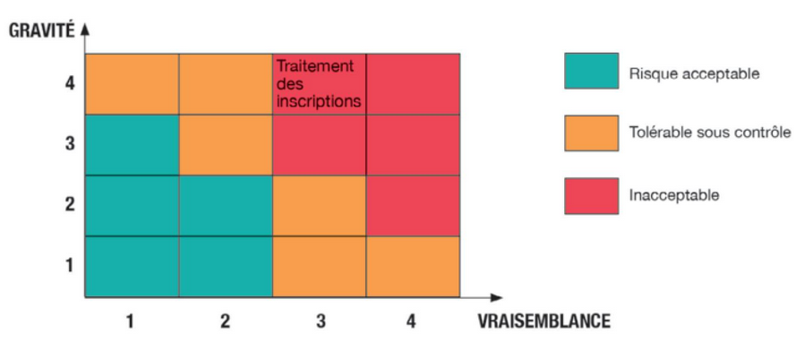

## Cours - Typologie des risques et leurs impacts

### Retour sur les vulnérabilités, les menaces et les risques

- **Vulnérabilité** : faille, faiblesse de cybersécurité du SI qui peut affecter son fonctionnement normal. On la note **V**.
- **Menace** : cause intentionnelle (dans le cadre de la cybersécurité) ou non-intentionnelle (dans le cadre de la sécurité) qui peut entraîner des dommages sur le SI. On la note **M**.
- **Probabilité d'exploitation** : probabilité de l'exploitation d'une **vulnérabilité** par une **menace**. On la note **P**. **Une probabilité d'exploitation est fonction d'une vulnérabilité et d'une menace associée** => **P = V x M**.
- **Impact** : gravité de l'exploitation pour l'organisation. On le note **I**.
- On peut alors retenir cette définition du risque : **Le risque est l'estimation de la probabilité d'exploitation d'une vulnérabilité par une menace et de son impact** => **Risque = P x I**.
- En résumé, chaque fois qu'on a une *vulnérabilité*, une *menace* associée et que la concrétisation de cette menace a un *impact* sur l'organisation, on a un *risque*.
- On va donc :
  - identifier et mesurer les vulnérabilités
  - identifier et mesurer les menaces associées
  - pour chaque association vulnérabilité/menace, calculer la probabilité que ça arrive effectivement (P = V x M)
  - maintenant on suppose que ça arrive, et on évalue l'impact I (mesure de la gravité)
  - finalement, on calcule le risque correspondant (R = P x I = V x M x I)

### La méthode EBIOS

La méthode _EBIOS Risk Manager_ (Expression des Besoins et Identification des Objectifs de Sécurité) développée par l'ANSSI et retenue par la CNIL permet d'identifier et de hiérarchiser les différents risques dans un contexte clairement défini.

Un risque est défini par l'ANSSI comme « un scénario qui combine un événement redouté et un ou plusieurs scénarios de menaces ». Un événement redouté désigne par exemple la possibilité d'atteindre des données avec des conséquences probables sur la vie privée des personnes concernées.

### Évaluation des risques et cartographie

L'évaluation du niveau d'un risque est réalisée par le croisement de son niveau de vraisemblance (probabilité) et de sa gravité (impact), et permet ensuite de réaliser une **cartographie des risques** dont voici une illustration :

La vraisemblance reflète la probabilité ou la possibilité que l'un des modes opératoires de l'attaquant aboutisse à l'objectif visé. Elle dépend des vulnérabilités des supports face aux menaces et des capacités des sources de risque à les exploiter.

La gravité évalue l'enjeu d'un événement redouté sur des « valeurs métier », c'est-à-dire stratégiques pour l'organisation (impact) (informations confidentielles, processus métier, matériels, logiciels, etc.). Voici un exemple :

| Valeur métier   | Événement redouté                     | Impacts                                                                                                       | Niveau gravité |
| --------------- | ------------------------------------- | ------------------------------------------------------------------------------------------------------------- | -------------- |
| **Facturation** | Altération des infos sur les factures | Impossibilité de recevoir un paiement, perte de crédibilité, impossibilité de remplir les obligations légales | **G3- Grave**  |

### Les impacts des risques informatiques

L'ANSSI, au travers de sa méthode EBIOS, identifie différentes catégories d'impacts :

- **Impacts sur les missions et les services de l'organisation** : conséquences directes ou indirectes sur la réalisation des missions et services
- **Impacts humains, matériels ou environnementaux** :
  - **impacts sur la sécurité ou sur la santé des personnes** : conséquences sur l'intégrité physique des personnes
  - **impacts matériels** : dégâts matériels ou destruction de biens supports
  - **impacts sur l'environnement** : conséquences écologiques à court ou long terme
- **Impact sur la gouvernance** :
  - **impacts sur la capacité de développement ou de décision** : conséquences sur la liberté de décider, de diriger, de mettre en oeuvre la stratégie de développement
  - **impacts sur le lien social interne** : conséquences sur la qualité des liens sociaux au sein de l'organisation
  - **impacts sur le patrimoine intellectuel ou culturel** : conséquences sur les connaissances non-explicites accumulées par l'organisation sur le savoir-faire, les capacités d'innovation, les références culturelles communes
- **Impacts financiers** : conséquences pécuniaires
- **Impacts juridiques** : conséquences suite à une non-conformité légale, réglementaire, normative ou contractuelle
- **Impacts sur l'image et la confiance** : conséquences sur l'image de l'organisation, la notoriété, la confiance des clients
