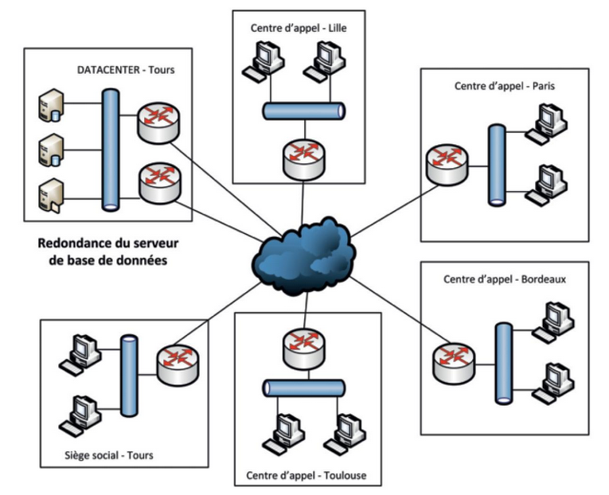

# Protection des données à caractère personnel

## Cours - Typologie des risques et leurs impacts

Voir [cette page](cours_typologie_risques.md).

## Contexte de l'organisation étudiée

### L'organisation

Fondée en 1993, l'entreprise KLIENTE compte cinq centres d'appels implantés dans des grandes villes de France : Lille, Paris, Tours, Bordeaux et Toulouse. Son siège social se situe à Tours, dans des locaux de 500 m².
Les centres d'appel sont des plateformes qui réalisent l'accueil téléphonique ou des démarches de télémarketing pour le compte d'entreprises clientes. En confiant l'externalisation de ces services à KLIENTE, ces entreprises peuvent se concentrer sur leur coeur de métier.

### Le prestataire informatique

La DSI est installée dans les bâtiments du siège social de KLIENTE. Elle est organisée en trois pôles de compétences :

- le pôle _Infrastructures et serveurs_ a pour activités principales le paramétrage et la sécurisation des éléments d'interconnexion et des serveurs
- le pôle _Applications_ est dédié au développement d'applications spécifiques pour les besoins de KLIENTE
- le pôle _Données à caractère personnel et données sensibles_ a pour mission de veiller à l'identification des risques et au respect de la législation sur les données à caractère personnel (DCP)

### Description du SI de l'organisation

L'infrastructure informatique de KLIENTE s'organise de la manière suivante :

- l'ensemble des sites est interconnecté par une liaison VPN
- KLIENTE assure une continuité des accès à ses serveurs via une redondance de ses éléments d'interconnexion
- la redondance des serveurs de base de données assure la continuité des accès aux données stockées, notamment aux DCP

### Cahier des charges

Les activités de KLIENTE la conduisent à appliquer une politique rigoureuse en matière de protection des DCP. Celle-ci doit répondre à quatre objectifs majeurs :

- le **recensement des traitements des DCP** au sein de l'organisation, notamment lors des études de marché réalisées pour le compte des clients
- l'**identification des risques** liés aux traitements des DCP durant le processus d'une étude de marché
- la **vérification du respect de la législation** en matière de traitement et de conservation des DCP
- la **sensibilisation des différents acteurs** (opérateurs téléphoniques, managers, etc.) à la protection des DCP

### Mission

Vous êtes accueilli au sein du pôle _DCP et données sensibles_. Vous participez à différentes missions destinées à assurer la protection des DCP collectées par KLIENTE.

## Situation

Depuis quelques mois, KLIENTE observe une forte croissance de la demande de ses clients pour la réalisation d'études de marché. Sur cette même période, des incidents ont été constatés : perte ou divulgation de données dont certaines sont à caractère personnel. Ces incidents peuvent avoir des conséquences catastrophiques pour la réputation de KLIENTE et engendrer des pertes financières importantes.

On vous demande de recenser les traitements réalisés lors du processus d'étude de marché afin de mieux identifier les risques qui pèsent sur la protection des DCP.

## Partie 1 - Recensement des traitements sur les DCP

Le traitement des DCP liées à la réalisation d'études de marché doit être conforme avec les directives de la CNIL. On vous demande d'aider vos collègues à identifier les DCP et à recenser les traitements réalisés.
Pour cette mission, vous devez prendre en compte les contraintes spécifiques en matière de traitement des données qui pèsent sur les centres d'appel de KLIENTE.

### Documents relatifs à la partie 1

Les documents relatifs à la partie 1 sont sur [cette page](docs_partie_1.md).

### Travail à faire

Q1. (Doc. 1) **Identifiez les DCP parmi celles recueillies lors de la réalisation d'une étude de marché. Justifiez votre réponse.**

---

Après réception de l'accord oral de la personne interrogée, les opérateurs du centre d'appel peuvent enregistrer la conversation téléphonique afin de ne pas commettre d'erreurs dans la collecte des informations. Dans ce cas, les opérateurs précisent la finalité de l'enregistrement.

Q2. En vous documentant sur le site de la CNIL, **analysez la conformité de la situation décrite ci-dessus avec les directives de la CNIL.**

---

Un de vos collègues de l'équipe informatique a schématisé le processus de gestion des appels téléphoniques pour la réalisation d'une étude de marché. Il a également réalisé un tableau permettant de lister les opérations effectuées sur les DCP tout au long de ce processus.

Q3. (Doc. 2, 3) **Complétez le tableau de recensement des opérations réalisées lors d'une étude de marché chez KLIENTE.**

---

KLIENTE désire mobiliser plusieurs canaux (par exemple : courriel, téléphone et SMS) pour sa collecte de données. L'application ComPlus (doc. 6) est actuellement testée pour accompagner cette démarche. Certains incidents sont malheureusement déjà remontés.

Q4. (Doc. 4, 5, 6) **Repérez les difficultés rencontrées avec la nouvelle application. Précisez en quoi elles contribuent à affaiblir la protection des DCP.**

---

## Partie 2 - Identification des risques liés aux DCP

On souhaite maintenant identifier les risques liés au traitement des DCP dans le cadre du processus d'étude de marché. Pour réaliser ce travail, vous devez prendre appui sur la méthode PIA (_Privacy Impact Assesment_, « analyse d'impact relative à la protection des données ») proposée par la CNIL, et présentée dans le doc. 7.

### Documents relatifs à la partie 2

Les documents relatifs à la partie 2 sont sur [cette page](docs_partie_2.md).

### Travail à faire

La première phase du PIA repose sur la compréhension du contexte.

Q1. (Doc. 7, 8) **Identifiez, dans la description du contexte, les éléments permettant d'identifier les vulnérabilités liées au traitement des DCP.**

---

L'identification des menaces et des événements redoutés est un préalable à la cartographie des risques.

Q2. (Doc. 9, 10) **Complétez le tableau d'analyse des scénarios de menaces présenté dans le document 10. Justifiez les niveaux de vraisemblance retenus pour chaque menace.**

---

Q3. (Doc. 9, 10, 11) **Retrouvez, pour chaque risque mentionné, l'événement redouté et son niveau de gravité estimé, en reprenant et complétant le document 11.**

---

Q4. **Cartographiez les risques liés au traitement des DCP par un schéma croisant les niveaux de vraisemblance et de gravité déterminés précédemment.**

---

Q5. **Rédigez une note de synthése à l'intention du DSI pour l'informer des risques identifiés et leur hiérarchisation.**
